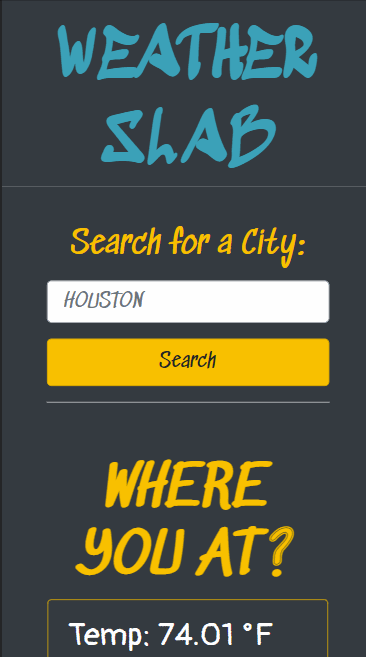

# Weather Slab 🌁

Don't get lost in the sauce! Use Weather Slab to bail out of mad rainy days ⛈️ and into sunny skies ahead! ☀️ Or maybe it's a winter chill you're after? ❄️ Whatever the digs you're looking to get into we're here to serve you some FAT weather data by the SLAB. 🕶️

## 📚 Table of Contents

- [Weather Slab 🌁](#weather-slab-)
  - [📚 Table of Contents](#-table-of-contents)
  - [🧾 Features](#-features)
  - [📖 Description](#-description)
  - [🛠️ Installation](#️-installation)
  - [👨‍🏫 Usage](#-usage)
  - [🥂 Credits](#-credits)
  - [📇 License](#-license)
  - [👋 How to Contribute](#-how-to-contribute)

## 🧾 Features

- Weather dashboard for multiple cities
- Can be used to plan trips accordingly
- Current and future weather conditions for any city
- Searched cities added to history
- Persistent search history data
- Displays icon representations of weather conditions
- Temperature displayed in Farenheit
- Humidity levels
- Wind Speed in miles per hour
- UV Index including a color to represent severity from 0 - 11+
- 5-Day forecast of future weather conditions
- Clickable search history list items to revisit current and future conditions of saved cities

## 📖 Description

🗺️ This repository contains a simple weather dashboard that allows users to view current and future weather conditions for a given city in order to plan trips accordingly. This web app was built for an anonymous friend who was interested in cross-referencing future weather data of different potential destinations for an upcoming trip. This Minimum Viable Product (MVP) allows users to see in-depth data updated in realtime about cities of their choosing and saves their search results into an interactive list with persisting data.

👨‍💻 During the creation of this product I learned how to fetch JSON data from a server-side API. I chose to use two APIs provided by OpenWeatherMap. One which provided basic current weather information queried using the name of the city entered into the search form input. This Current Weather data API call also provided us the coordinates for that city, which we used to call another separate API provided by OpenWeatherMap named the One Call API. This response provided us the needed JSON data for our future daily forecast element, as well as the critical UV Index information which we render using a color-coded severity scale provided by the EPA.

🕰️ We used the native JavaScript Date constructor to grab the Unix Timestamp provided in our JSON during the API call and use the toLocaleString method to display a human-readable date specified by method's properties. We also accessed the Open Weather database of icons using a special code provided by their API to match .PNG icons to weather conditions.

📜 The search history component of Weather Slab provides a dynamic list of cities that can be selected to re-visit their current and future weather conditions. The list of cities will persist in local storage between sessions, and I added a check that prevents cities from being duplicated (helped by also forcing search strings to uppercase) to the list using a simple for loop. I also chose to prepend list items rather than append them, keeping the most recent search terms near the top.

🔫 I remain loyal to SCSS, including it on this project, though admittedly not leveraging the extent of its true power, as I chose to use Bootstrap utility classes as the fulcrum for styling here. My hope is that travelers will appreciate the pared down style of this no-nonsense app with remnants of street tags, chalk-writing, and straight-to-the-point weather information.

## 🛠️ Installation

Locate the dropdown menu labeled 'Code' to the left of the About section in the main page of this repository. From there, select your preferred cloning method from HTTPS, SSH, or the GitHub CLI. For this demonstration, we will be using the SSH method. Copy the link and head to your terminal. From the command line you should enter:

    git clone <INSERT_SSH_KEY_HERE>

Replacing the above placeholder with the link copied from GitHub. This will clone the repository into a local directory on your machine. And that's it! Happy Hacking! 🚀

## 👨‍🏫 Usage

This code is strictly for use by homies who understand the slab culture as well as anybody who recognizes that H-Town hol's it down, and is only provided as material for study and otherwise double-checking implementation of server-side APIs. Any violations of these use cases will result in rapidly falling barometers, flurries, wooly-wearing, and general grimness of the skies. Screenshots of original mockup are included.

Mobile-responsive version

**Supports most major touchscreen devices**

## 🥂 Credits

UT Austin Coding Boot Camp https://techbootcamps.utexas.edu/coding/

Kyle Ferguson https://github.com/kferguson52

Stack Overflow https://stackoverflow.com/

W3 Schools https://www.w3schools.com/

MDN Web Docs https://developer.mozilla.org/en-US/

OpenWeather https://openweathermap.org/

The US Environmental Protection Agency https://www.epa.gov/sunsafety/uv-index-scale-0

Free Color Picker from the Microsoft Store https://www.microsoft.com/en-us/p/free-color-picker-color-picker-from-screen-html-color-picker-hex-color-picker/9p9qkfj0fh21

The City of Houston https://en.wikipedia.org/wiki/Houston

## 📇 License

MIT License

Copyright (c) 2022 Keenan R. Chiasson

Permission is hereby granted, free of charge, to any person obtaining a copy
of this software and associated documentation files (the "Software"), to deal
in the Software without restriction, including without limitation the rights
to use, copy, modify, merge, publish, distribute, sublicense, and/or sell
copies of the Software, and to permit persons to whom the Software is
furnished to do so, subject to the following conditions:

The above copyright notice and this permission notice shall be included in all
copies or substantial portions of the Software.

THE SOFTWARE IS PROVIDED "AS IS", WITHOUT WARRANTY OF ANY KIND, EXPRESS OR
IMPLIED, INCLUDING BUT NOT LIMITED TO THE WARRANTIES OF MERCHANTABILITY,
FITNESS FOR A PARTICULAR PURPOSE AND NONINFRINGEMENT. IN NO EVENT SHALL THE
AUTHORS OR COPYRIGHT HOLDERS BE LIABLE FOR ANY CLAIM, DAMAGES OR OTHER
LIABILITY, WHETHER IN AN ACTION OF CONTRACT, TORT OR OTHERWISE, ARISING FROM,
OUT OF OR IN CONNECTION WITH THE SOFTWARE OR THE USE OR OTHER DEALINGS IN THE
SOFTWARE.

## 👋 How to Contribute

See the [Contributor Covenant](https://www.contributor-covenant.org/) for details on how to contribute
